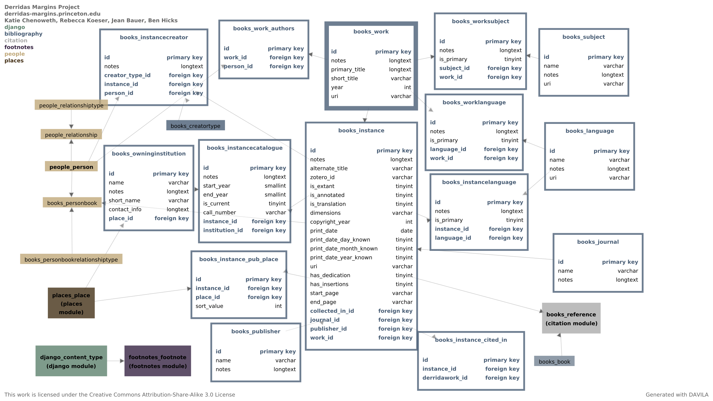
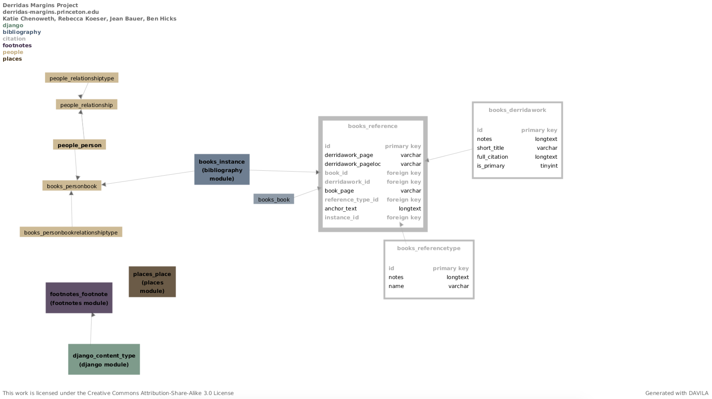
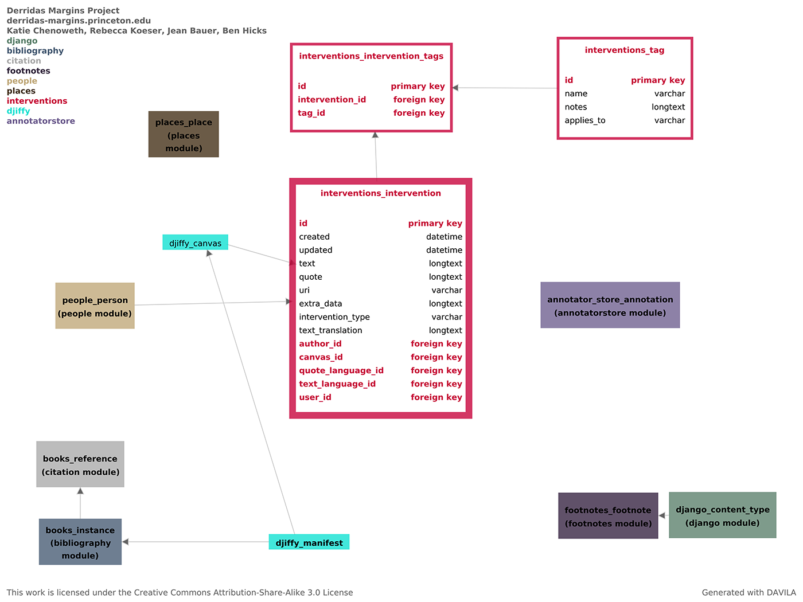
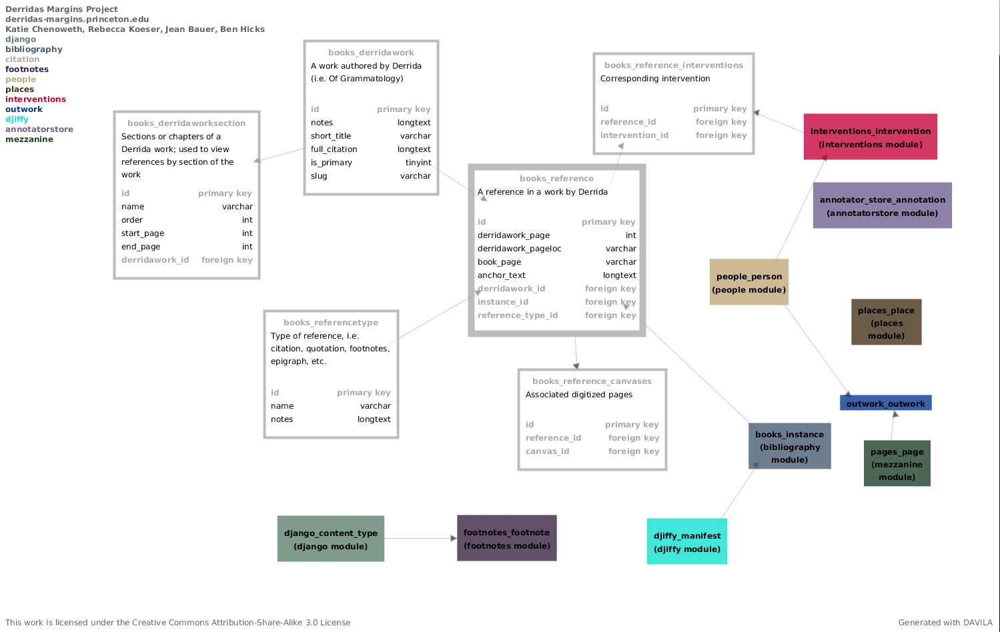
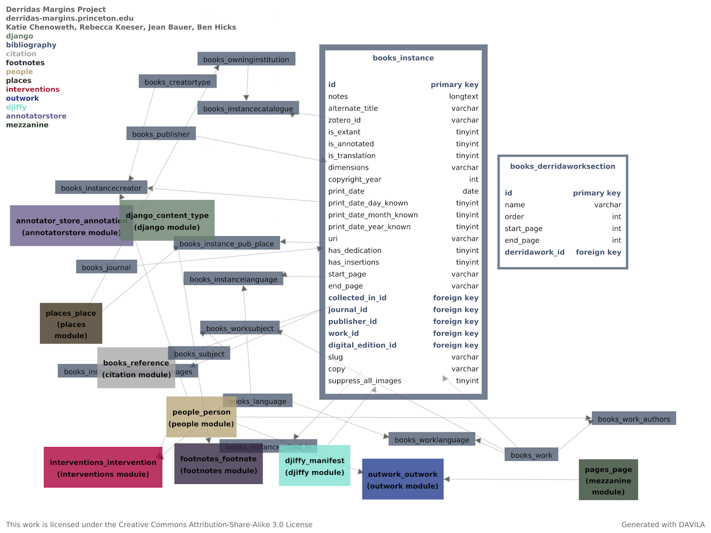
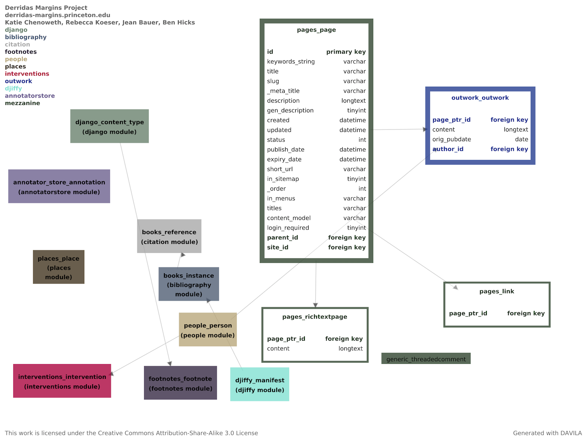

Architecture
============

.. toctree::
   :maxdepth: 2

Database
--------

Database Schema as rendered in DAVILA

.. image:: _static/derrida.schema-2.png
    :target: _static/derrida.schema-2.png
    :alt: Derrida schema page 3

.. image:: _static/derrida.schema-3.png
    :target: _static/derrida.schema-3.png
    :alt: Derrida schema page 4

0.8 Interventions (Phase I) Module
~~~~~~~~~~~~~~~~~~~~~~~~~~~~~~~~~~

0.9 (Library works and references)
~~~~~~~~~~~~~~~~~~~~~~~~~~~~~~~~~~

Major changes to schema noted here include:

  * Refinements to Work and Instance tables
  * Outwork tables and Mezzanine functionality

